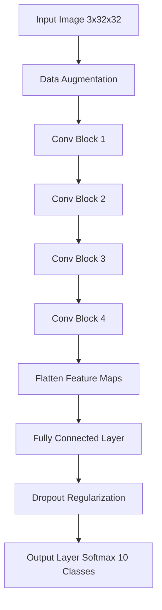
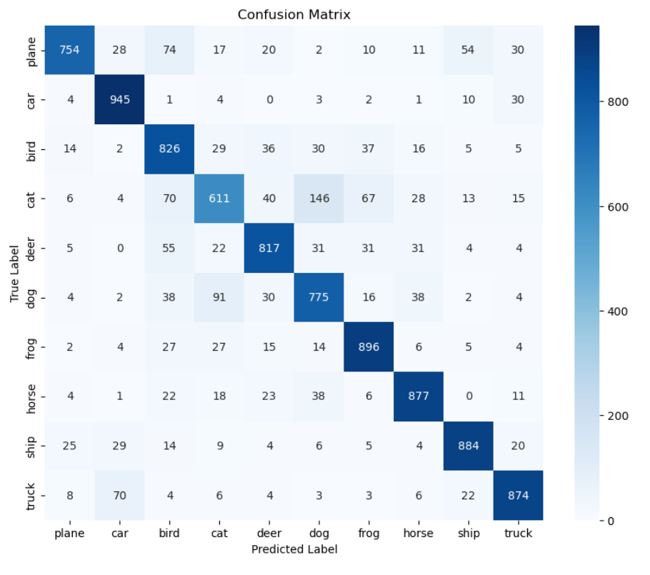
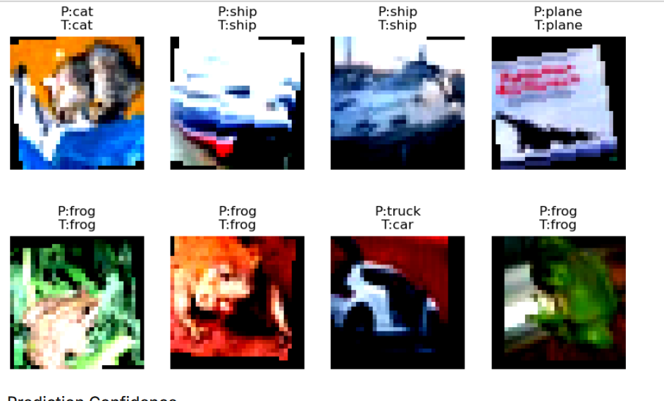
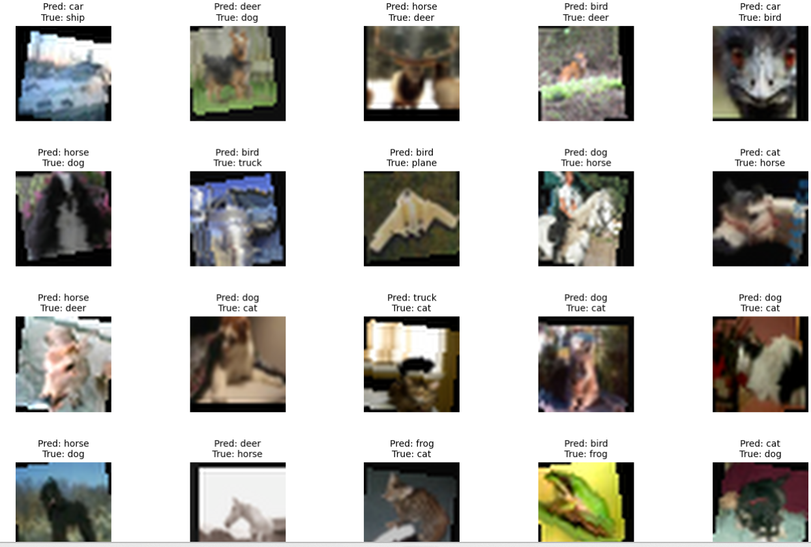
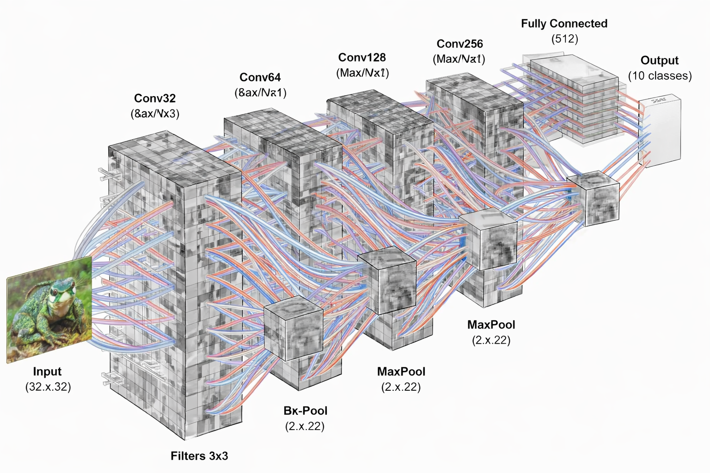

# 🧠 CIFAR-10 Image Classification using Deep Convolutional Neural Networks (PyTorch)

<p align="center">


</p>

A **deep convolutional neural network (CNN)** implemented in **PyTorch** for **multi-class image classification on the CIFAR-10 dataset**.

The project demonstrates a **complete deep learning pipeline** including:

* advanced **data preprocessing**
* **data augmentation**
* deep CNN architecture design
* model training and optimization
* **performance evaluation and interpretability**

The implementation focuses on **robust feature extraction**, **stable training dynamics**, and **generalization performance**.

---

# Dataset

The **CIFAR-10 dataset** is a standard benchmark in computer vision consisting of:

```
60,000 RGB images
Resolution: 32 × 32
10 object categories
```

### Class Categories

```
airplane
automobile
bird
cat
deer
dog
frog
horse
ship
truck
```

Dataset partitioning:

| Split    | Samples |
| -------- | ------- |
| Training | 50,000  |
| Testing  | 10,000  |

Despite its small image resolution, CIFAR-10 remains challenging due to **high intra-class variability** and **low spatial resolution**.

---

#  System Architecture

The system implements a **deep hierarchical feature extraction pipeline** composed of stacked convolutional blocks followed by fully connected classification layers.



---

#  CNN Architecture Details

Each convolution block follows a **standardized deep learning design pattern**:

```
Conv2D → Batch Normalization → ReLU Activation → MaxPooling
```

This structure improves **gradient propagation**, **training stability**, and **feature abstraction**.

### Architecture Specification

| Layer          | Output Channels | Operation                         |
| -------------- | --------------- | --------------------------------- |
| Conv Block 1   | 32              | Conv + BatchNorm + ReLU + MaxPool |
| Conv Block 2   | 64              | Conv + BatchNorm + ReLU + MaxPool |
| Conv Block 3   | 128             | Conv + BatchNorm + ReLU + MaxPool |
| Conv Block 4   | 256             | Conv + BatchNorm + ReLU + MaxPool |
| Dense Layer    | 512             | Fully Connected                   |
| Regularization | —               | Dropout                           |
| Output         | 10              | Softmax Classification            |

This hierarchical architecture progressively learns:

```
Edges → Textures → Shapes → Object Representations
```

---

# ⚙️ Data Preprocessing Pipeline

To improve **generalization capability**, several **stochastic data augmentation techniques** are applied during training:

```
Random Cropping
Random Horizontal Flipping
Random Rotation
Color Jittering
Normalization
```

Normalization uses the official CIFAR-10 statistics:

```
Mean: (0.4914, 0.4822, 0.4465)
Std:  (0.2023, 0.1994, 0.2010)
```

These augmentations increase **effective dataset diversity**, preventing **overfitting** and improving **model robustness**.

---

# 🚀 Training Configuration

Training was performed using **mini-batch stochastic gradient descent optimization**.

| Parameter      | Value                   |
| -------------- | ----------------------- |
| Optimizer      | Adam                    |
| Loss Function  | CrossEntropyLoss        |
| Epochs         | 50                      |
| Batch Size     | 64                      |
| Scheduler      | Learning Rate Scheduler |
| Regularization | Dropout + BatchNorm     |

---

# 📈 Model Performance

Final evaluation on the **10,000 image test set**:

```
Test Accuracy: 82.59 %
```

Evaluation metrics include:

* classification accuracy
* confusion matrix
* per-class accuracy analysis
* qualitative prediction inspection

---

# 🔍 Confusion Matrix

The confusion matrix highlights class-level performance and misclassification patterns.



Common confusions occur between visually similar categories such as:

```
cat ↔ dog
ship ↔ airplane
truck ↔ automobile
```

These errors arise primarily from **low spatial resolution and visual similarity**.

---

# 🖼 Model Predictions

Example predictions generated by the trained CNN.



Each sample displays:

```
Predicted Class
Ground Truth Label
```

---

# ⚠️ Misclassified Samples

Misclassification analysis reveals the limitations of the network.



Such qualitative evaluation helps understand **decision boundaries and feature ambiguities**.

---

## Architecture Visualization



# ⭐ Key Strengths of the Model

The proposed CNN architecture incorporates several design decisions that improve learning efficiency:

### Hierarchical Feature Extraction

Stacked convolutional blocks allow the network to learn **multi-scale spatial representations**.

### Batch Normalization

Stabilizes training by mitigating **internal covariate shift**, enabling faster convergence.

### Data Augmentation

Artificially increases training diversity, improving **generalization performance**.

### Regularization via Dropout

Reduces overfitting in dense layers.

### Efficient Architecture

The network maintains a **balanced depth-to-parameter ratio**, enabling strong performance without excessive computational cost.

---

#  Repository Structure

```
cnn-cifar10-pytorch
│
├── CNN_CIFAR10.ipynb
├── README.md
├── requirements.txt
│
└── results
    ├── confusion_matrix.png
    ├── predictions.png
    └── misclassified.png
```

---

# Running the Project

Clone the repository:

```
git clone https://github.com/Asmit159/cnn-cifar10-pytorch.git
cd cnn-cifar10-pytorch
```

Install dependencies:

```
pip install torch torchvision matplotlib seaborn
```

Run the notebook:

```
jupyter notebook
```

Open:

```
CNN_CIFAR10.ipynb
```

---

# Learning Outcomes

This project demonstrates practical understanding of:

* convolutional neural networks
* feature extraction in computer vision
* deep learning model training
* performance evaluation and interpretability
* PyTorch-based deep learning pipelines

---

# 👨‍💻 Author
Asmit Mandal
Deep Learning Minor Project
CNN-based Image Classification using **PyTorch**

If you found this project useful ⭐ consider **starring the repository**.

